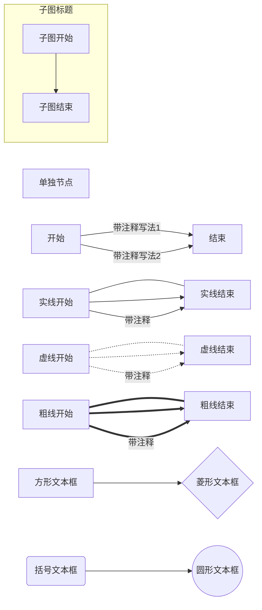

# Program experience

[TOC]

## Ubuntu 学习过程

> 记录学习并体验linux系统（整活）

### 安装Ubuntu20.04 过程问题

#### error5：input/output Error

解决方案：重新换了闪迪的U盘在“Try Ubuntu”的系统中完成了重新制作Ubuntu启动盘


### 进入系统

#### 镜像源更换

> 原来的镜像源太慢了；add：清华的镜像源也慢

先安装vim对`sources.list`进行操作

```bash
sudo apt upadate //防止出现找不到vim软件包的情况
sudo apt-get install vim //安装vim
cd /etc/apt //sources.list文件所在位置
sudo cp sources.list sources.list.bak \\备份文件
vim sources.list
```

连接网络访问阿里云镜像网站获取镜像地址(https://developer.aliyun.com/mirror/)

__Note:__需要对应linux版本（本次实验为Ubuntu 20.04）

配置文件(本次)

```bash
deb http://mirrors.aliyun.com/ubuntu/ focal main restricted universe multiverse
deb-src http://mirrors.aliyun.com/ubuntu/ focal main restricted universe multiverse

deb http://mirrors.aliyun.com/ubuntu/ focal-security main restricted universe multiverse
deb-src http://mirrors.aliyun.com/ubuntu/ focal-security main restricted universe multiverse

deb http://mirrors.aliyun.com/ubuntu/ focal-updates main restricted universe multiverse
deb-src http://mirrors.aliyun.com/ubuntu/ focal-updates main restricted universe multiverse

deb http://mirrors.aliyun.com/ubuntu/ focal-proposed main restricted universe multiverse
deb-src http://mirrors.aliyun.com/ubuntu/ focal-proposed main restricted universe multiverse

deb http://mirrors.aliyun.com/ubuntu/ focal-backports main restricted universe multiverse
deb-src http://mirrors.aliyun.com/ubuntu/ focal-backports main restricted universe multiverse
```


#### V2ray翻墙

> 没有翻墙GitHub访问实在是太慢了
>
> 机场网址：cylink.wtf
>
> 配置文档：https://world.crisp.help/zh/article/qv2ray-1c7q4iq/

##### 步骤概述

- 下载安装QV2ray   [link](https://github.com/Qv2ray/Qv2ray/releases)
- 下载内核  [link](https://github.com/v2ray/v2ray-core/releases)      [install link](https://github.com/v2fly/v2ray-core/releases/tag/v4.31.0)(选择正确的包：[v2ray-linux-64.zip])
- 下载SSR插件 [link](https://github.com/Qv2ray/QvPlugin-SSR)       [install link](https://github.com/Qv2ray/QvPlugin-SSR/releases/tag/v2.0.3)


##### 下载安装QV2ray

安装‘.deb’后缀`.AppImagin`格式打开方便

安装后qv2ray保存在隐藏文件夹 `/home/onemotre/.config/qv2ray`中

##### 安装内核

将内核放在文件夹中并解压

在首选项中找到内核版本


在`V2ray核心可执行文件路径`中选择原来压缩包中v2ray

在`V2Ray资源目录`中选择刚刚解压的文件


点击`检查V2Ray核心设置`检查之前操作是否完成

之后便可在分组中进行添加机场


添加机场


然后就可以快乐的访问[谷歌](https://www.google.com/chrome/)了


### 配置语言环境

#### c（gcc）

直接下载`sudo apt-get install gcc`

`gcc --version`用于检查是否安装好

###### 试着运行一个c语言程序

直接用`vim [filename].c`创建一个c文件

输入代码

```c
#include <stdio.h>
int main()
{
    printf("hello wolrd");
    return 0;
}
```

保存退出

编译`gcc [filename].c` 结果产生一个`a.out`文件

`./a.out`或直接将文件拖入terminal进行运行


#### java（参考coreJava）

从[官网](http://jdk.java.net/15/)下载jdk的tar.gz包（jdk15）

使用代码将包解压到/opt目录（/opt通常防止下载的软件）

```bash
sudo tar xzf openjdk-15.0.2_linux-x64_bin.tar.gz -C /opt
```

###### 编辑环境变量

```bash
vim ~/.bashrc \\编辑环境变量
```

在文本最后添加

```bash
export PATH=jdk/bin:$PATH  \\jdk为刚才解压的包的位置eg：PATH = /opt/jdk-15.0.2/bin:$PATH
```

最后强制刷新环境变量

```bash
source ~/.bashrc
```

检测安装是否成功

```bash
javac --version
```


###### 试着运行java

bash中操作

```bash
mkdir ~/文档/java/testInstall && cd ~/文档/java/testInstall
vim hello.java
```

代码

```java
public class hello
{
    public static void main(String[] atgs)
    {
        String greeting = "Hello World!";
        System.out.println(greeting);
        for(int i = 0; i < greeting.length; i++)
            System.out.print("=");
        System.out.println();
    }
}
```

运行

```bash
javac hello.java
java hello
```


### 安装集成开发环境（Vscode）

官网下载安装包 [link](https://code.visualstudio.com/)

跟着操作就完了。。。


### Vim基本操作

`vim 【文件名】`对指定文件进行操作

 i 键进入编辑模式

esc 退出编辑模式

退出编辑模式后

`:w`表示保存  `:q`表示退出  `:wq`表示保存并退出  `:q!`表示强制退出


### Terminal基本操作

#### 文件移动

****

`mv [文件名称] [目标路径]`一次可添加多个文件（在可视化窗口中拖动即可）


#### 删除文件

****

`rm -rf 【文件名】`彻底删除该目录中所有文件（用于删除文件夹）

`-r`表示彻底删除（只可以删除文件，不能删除文件夹）

`-f`表示删除目录


#### 解压压缩文件

****

- tar.gz

`tar xzf [包名] -C 【目标路径】`路径路径可省略

- zip

`unzip [包名]`


#### 查看文本

****

`cat 【文件名】`


#### 新建文本

1. `touch 【文件名】`
2. `vim 【文件名】`


## Github学习（官方文档）

### 步骤1.创建存储库（Repository）

> 存储库通常放置单个项目（可包含大多数文件）通常放置README文档

1. 在右上角，您的头像或标识旁边，单击 然后选择“**新建存储库”**。
2. 命名您的存储库`hello-world`。
3. 写一个简短的描述。
4. 选择**使用README初始化此存储库**。


单击存储库

### 步骤2.创建一个分支（Branch）

**分支**是一次在不同版本的存储库上工作的方式。

默认情况下，您的存储库有一个名为的分支`main`，该分支被视为权威分支。我们使用分支进行实验并进行修改，然后再将其提交到`main`。

当您在分支机构外创建分支机构时`main`，您将`main`在当时复制或快照。如果`main`在您处理分支时其他人对该分支进行了更改，则可以提取这些更新。

该图显示：

- 该`main`分支
- 一个新的分支称为`feature`（因为我们正在该分支上进行“功能工作”）
- 被`feature`合并之前的旅程`main`


#### 创建一个新分支

1. 转到新的存储库`hello-world`。
2. 单击文件列表顶部的**分支：main**的下拉列表。
3. `readme-edits`在新的分支文本框中输入分支名称。
4. 选择蓝色的“**创建”分支**框，或在键盘上按“ Enter”。


### 步骤3.进行并提交更改（Make and commit changes）

太棒了！现在，您在`readme-edits`分支的代码视图中，该视图是的副本`main`。让我们进行一些编辑。

在GitHub上，保存的更改称为*commits*。每个提交都有一个关联的*提交消息*，该描述是解释为什么进行特定更改的说明。提交消息记录了更改的历史记录，因此其他贡献者可以了解您所做的事情以及原因。

#### 进行并提交更改

1. 单击`README.md`文件。
2. 点击 要编辑的文件视图右上角的铅笔图标。
3. 在编辑器中，写一些关于您自己的信息。
4. 编写描述您所做更改的提交消息。
5. 单击**提交更改**按钮。


这些更改将仅对您`readme-edits`分支上的README文件进行，因此现在此分支包含的内容不同于`main`。

### 步骤4.打开拉取请求（Open a Pull Request）

不错的编辑！现在您已经在分支的分支中进行了更改`main`，您可以打开*拉取请求*。

拉取请求是GitHub上协作的核心。当您打开*请求请求时*，您是在提出更改，并要求某人检查并提取您的贡献并将其合并到其分支中。拉取请求显示两个分支中内容的*差异*或差异。更改，加法和减法以绿色和红色显示。

提交后，即使在代码完成之前，也可以打开请求请求并开始讨论。

通过在请求请求消息中使用GitHub的[@mention系统](https://help.github.com/articles/about-writing-and-formatting-on-github/#text-formatting-toolbar)，您可以要求特定人员或团队提供反馈，无论他们是在大厅还是10个时区之外。

您甚至可以在自己的存储库中打开拉取请求，然后自己合并它们。这是在从事大型项目之前学习GitHub流程的好方法。

#### 打开请求更改自述文件的请求

| 步骤                                                         | 屏幕截图                                                     |
| ------------------------------------------------------------ | ------------------------------------------------------------ |
| 点击 **“拉取请求”**选项卡，然后从“拉取请求”页面中，单击绿色的“**新建拉取请求”**按钮。 | [](https://guides.github.com/activities/hello-world/pr-tab.gif) |
| 在“**示例比较”**框中，选择`readme-edits`要与`main`（原始）进行比较的分支。 | [](https://guides.github.com/activities/hello-world/pick-branch.png) |
| 在“比较”页面上的差异中查看您的更改，确保它们是您要提交的。   | [](https://guides.github.com/activities/hello-world/diff.png) |
| 如果您对要提交的更改感到满意，请单击绿色的大的**创建请求请求**按钮。 | [](https://guides.github.com/activities/hello-world/create-pr.png) |
| 给您的请求请求一个标题，并写下您的更改的简短描述。           | [](https://guides.github.com/activities/hello-world/pr-form.png) |

完成您的消息后，单击**创建请求请求**！

### 步骤5.合并您的拉取请求

在最后的步骤中，是时候将您的更改集中在一起了–将`readme-edits`分支合并到`main`分支中。

1. 点击绿色的**合并拉取请求**按钮，将更改合并到中`main`。
2. 点击**确认合并**。
3. 继续并删除分支，因为已经合并了其更改，请在紫色框中使用“**删除分支”**按钮。

****

## VScode使用

配套教材：https://vscode.cool

### 搭建Git连接（linux环境）

安装Git

```bash
sudo apt install git -y
```

配置Git

```bash
git config --global user.name "your name" \\your name 替换成github的用户名
git config --global user.email your@email.com	\\your@email.com 替换成注册github的邮箱
```

生成ssh公钥 [官方文档link](https://docs.github.com/en/github/authenticating-to-github/generating-a-new-ssh-key-and-adding-it-to-the-ssh-agent)

```bash
ssh-keygen -t ed25519 -C "your_email@example.com" \\your@email.com 替换成注册github的邮箱
```

提示输入密码，不管直接回车（基础）

```bash
> Enter passphrase (empty for no passphrase): [Type a passphrase]
> Enter same passphrase again: [Type passphrase again]
```

启动密钥代理

```bash
eval "$(ssh-agent -s)"
```

生成私钥代码

```bash
 ssh-add ~/.ssh/id_ed25519 \\如果您使用其他名称创建密钥，或者要添加具有其他名称的现有密钥，请使用私有密钥文件的名称替换命令中的id_ed25519。
```

获取私钥代码

```
cd ~
ls .ssh
```

将公钥添加到github

```bash
cat id_ed25519.pub \\打印公钥并复制
```

进入个人 [link](https://github.com/settings/keys)


添加公钥即可

测试公钥

```bash
ssh -T git@github.com
```


### 搭建Git环境（windows环境）

安装Git [link](https://git-scm.com/downloads)

__Note：__在setup文件安装全部选择默认选项（注意检查是否安装git bash即可）

__所有指令在git bash中进行__ 

#### 设置git

```bash
git config --global user.name "your name" 
git config --global user.email your@example.com
```

#### 生成公钥与私钥

```bash
ssh-keygen -t rsa -b 4096 -C "your_email@example.com"
eval $(ssh-agent -s)
ssh-add ~/.ssh/id_rsa
```

#### 将公钥添加到github

> 具体操作见（linux环境下的git配置）

附：windows下复制文件内容命令

```bash
clip < ~/.ssh/id_rsa.pub
```

#### 测试

```bash
ssh -T git@github.com
```


### VScode中使用Git命令

****

#### 常用Git命令

##### 本地类

`git init`新建一个git仓库

`git status 【参数】` 查看git状态		`-s`简化显示（开头标记A为暂存状态，已经拉入跟踪，没有提交）

`git add 【文件名】` 将未跟踪（untracked file）的文件拉入跟踪（tracked file）项目； 将修改状态的文件添加到暂存区； 将冲突的文件标记为冲突已解决

`git commit` 将存入的暂存区的文件进行提交（具体在下）

```bash
git commit -m 'init' \\将暂存区进行提交（‘init’为提交信息，意为提交）
git commit -am 'init' \\快速跟踪并提交修改
```

`git restore` 取消对一个文件的修改

`git diff` 查看修改中的文件有哪些地方进行了删除，新增

`git checkout` 切换分支

`git branch 【参数】` 分支操作	`-l`查看当前分支

```bash
git checkout -b [filename] \\新建并切换到filename分支
```

`git merge` 合并其他分支（常常解决冲突）

`git stash` 保存当前工作情况的分支，以便切换到其他分支

```bash
git stash pop \\恢复到切换分支前的状态
```


#### 远程git命令

##### 对已有仓库进行克隆

`git clone`：用于克隆一个远程仓库

```bash
git clone [link] \\ 连接为下方所示获取
```

1. 在 GitHub 上，导航到仓库的主页面。
2. 在文件列表上方，单击  Code（代码）。


`git pull`：用于拉取远程仓库的更新并将更新合并到本地分支，它等于git fetch 加 git merge

`git push`：将本地的修改提交到远程分支（需要将所有代码提交`commit`）


## README.md 的编写

模板：https://github.com/RichardLitt/standard-readme

README的内容，是每个项目中都应该有的一个文件，目的是能简要的描述该项目的信息，让读者快速了解这个项目。


## 其他

### typora图床设置

> 使用图床：github； app：picgo

1. 下载picgo [link](https://github.com/Molunerfinn/PicGo/releases) 
2. 安装插件picgo-plugin-smms-user


## markdown学习

### mermaid 语法



